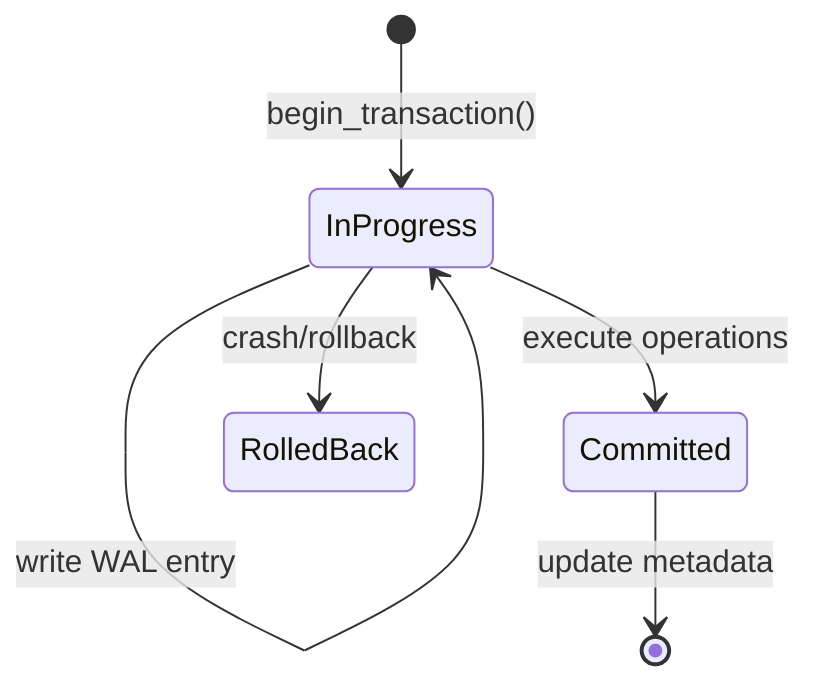

# ZTHFS - Zero-Trust Healthcare Filesystem

[](LICENSE)
[](https://www.rust-lang.org)
[](coverage/tarpaulin-report.html)

## Overview

ZTHFS implements a transparent encryption filesystem designed for medical data protection. The system provides cryptographic primitives and security mechanisms required for HIPAA/GDPR-compliant storage systems, delivered as a complete FUSE filesystem supporting transparent encryption and decryption operations.

The architecture follows a layered design with eight core modules. The encryption and integrity modules form the cryptographic foundation, implementing AES-256-GCM encryption with BLAKE3-based integrity verification. The security module provides access control through POSIX permission checking coupled with user and group whitelists. Transaction management ensures atomic operations through write-ahead logging, while key management handles secure storage and rotation of cryptographic keys. The FUSE filesystem layer exposes these capabilities through standard filesystem operations.

## Code Organization

The filesystem implementation has been refactored into focused modules, each containing related operations with inline tests. This organization improves maintainability by reducing cognitive load when navigating the codebase.

The modular structure separates concerns:

- Path operations handle virtual-to-physical path translation
- Inode operations manage unique identifier allocation and mapping
- Attribute operations retrieve file metadata
- File read/write operations handle data transfer with chunking support
- Chunk operations optimize large file storage
- Metadata operations persist file and directory attributes
- Directory operations manage folder creation and removal
- File creation, copy, and attribute modification operations provide complete file lifecycle management

Test coverage reaches 67.35% across 1869 lines, ensuring critical paths are validated while allowing flexibility for future development.

## Cryptographic Security

Encryption employs AES-256-GCM with a unique nonce per file. The nonce derives from BLAKE3(path || nonce_seed), a construction ensuring deterministic nonce generation for a given path while preventing nonce reuse across different files. Deterministic nonces enable file recovery without additional nonce metadata, whereas the nonce_seed prevents predictability. This design balances storage efficiency with cryptographic safety, as nonce reuse in GCM mode would compromise authentication guarantees.

Integrity verification supports two algorithms with distinct security properties. BLAKE3 provides cryptographic message authentication through keyed hashing for data requiring strong integrity guarantees. CRC32c offers a lightweight alternative where computational efficiency outweighs cryptographic strength. Checksums store as extended attributes, enabling verification without prior decryption.

Timing attack protection leverages constant-time comparisons from the `subtle` crate. Authentication failures trigger exponential backoff delays starting at 100ms and doubling with each attempt, capped at 5 seconds. Failed attempt counting persists across requests, with lockout durations calculated as 2^(attempt_count - 1) seconds, maxing at 1 hour. This construction follows best practices for online attack mitigation where the cost of successful brute force increases exponentially with attempt count.

## Access Control

The security validator implements POSIX permission checking augmented with user and group whitelists. File access requires membership in `allowed_users` or `allowed_groups`, ensuring that even users with appropriate POSIX permissions cannot access files unless explicitly authorized. The permission checker extracts owner, group, and mode bits from file metadata, then applies standard POSIX rwx logic to determine access rights.

Zero-trust mode, enabled via `with_zero_trust_root()`, removes the traditional Unix root bypass. In this configuration, uid 0 must pass the same permission checks as other users and must appear in the allowed users list. Root access attempts generate audit log entries at High severity, ensuring visibility of privileged operations. This design aligns with zero-trust principles where no actor receives implicit trust based solely on identity.

## Transaction Management

Write-ahead logging (WAL) ensures atomic operations and crash recovery. Each transaction records to a separate WAL file before execution, creating a durable log that survives system failures. The transaction lifecycle progresses through three states:



On startup, the WAL scans for incomplete transactions and automatically rolls them back, preventing partially-applied operations from corrupting filesystem state.

Copy-on-write (COW) primitives enable atomic file updates. The `atomic_write` function writes data to a temporary file, syncs to disk, then renames over the target. POSIX guarantees atomic rename operations, preventing partial writes from becoming visible.

## Key Management

The key management system provides a pluggable storage interface. `InMemoryKeyStorage` serves testing scenarios where persistence is unnecessary. `FileKeyStorage` encrypts keys at rest using a master key derived from system-specific entropy (hostname, machine-id, username). This derivation ensures that keys extracted from one system cannot be decrypted on another, adding physical security.

Each key stores with metadata including version number, creation timestamp, and expiration time. Key rotation generates a new version with an incremented version counter. The old version remains available until manually deleted, supporting gradual key migration.

## Filesystem Operations

The FUSE implementation provides fourteen operations covering standard filesystem functionality. Path resolution maps filesystem paths to internal inodes through bidirectional mappings stored in a sled database. File operations support chunked storage for large files, with configurable chunk sizes defaulting to 4MB.

Directory operations use marker files (`.zthfs_dir`) to persist directory metadata, enabling attribute preservation across filesystem remounts. Empty directory checks prevent removal of non-empty directories. Atomic rename operations move both metadata and chunk files using database batches, ensuring failures during rename do not result in partially-moved files.

File attribute modification supports chmod, chown, utime, and truncate operations through the `setattr` interface. Time conversions handle both absolute timestamps and the special `TimeOrNow::Now` value for utime operations. Permission checking occurs before attribute modification.

The complete operation set includes lookup, getattr, read, write, readdir, create, unlink, mkdir, rmdir, rename, setattr, open, release, and fsync. All operations include permission checks and audit logging.

## Usage

### Library API

Core modules expose a Rust API for integration into applications.

```rust
use zthfs::{
    core::encryption::EncryptionHandler,
    core::integrity::IntegrityHandler,
    config::EncryptionConfig,
};

let config = EncryptionConfig::random()?;
let handler = EncryptionHandler::new(&config);
let encrypted = handler.encrypt(data, "/path/to/file")?;

let checksum = IntegrityHandler::compute_checksum(
    &encrypted, "blake3", &config.key,
)?;
```

### Command Line Interface

The binary provides subcommands for filesystem management. `init` generates a configuration file with cryptographically secure random keys. `validate` checks configuration file syntax and security settings. `mount` mounts the FUSE filesystem using the specified configuration, while `unmount` cleanly unmounts. `health` displays component status for monitoring. `demo` runs cryptographic operations for verification. `info` shows version and build information.

## Testing

The test suite comprises 369 unit tests covering cryptographic operations, security validation, key management, transaction handling, and filesystem operations. Test coverage reaches 67.35% across the codebase.

Execute `cargo test --lib` to run the test suite. FUSE integration tests exist but require root privileges and are marked as ignored.

```bash
# Run unit tests
cargo test --lib

# Run with coverage
cargo tarpaulin --workspace --exclude-files '*/tests/*' --out Html

# Check code quality
cargo clippy --all-targets
```

## Implementation Status

Complete modules include encryption, integrity, logging, configuration, security validation, transactions, key management, and the FUSE filesystem implementation. All fourteen FUSE operations are implemented: lookup, getattr, read, write, readdir, create, unlink, mkdir, rmdir, rename, setattr, open, release, and fsync.

Not implemented features include HSM/KMS backends, performance monitoring metrics, and comprehensive integration tests. These represent areas for future development rather than gaps in core functionality.

## Development Roadmap

Short-term priorities focus on improving test coverage and production deployment tooling. Medium-term goals cover HSM/KMS backend implementations for environments requiring hardware security modules. Long-term objectives target distributed storage backends and multi-tenant isolation mechanisms.

## License

```
Copyright (c) 2025 Somhairle H. Marisol

All rights reserved.

Redistribution and use in source and binary forms, with or without modification,
are permitted provided that the following conditions are met:

    * Redistributions of source code must retain the above copyright notice,
      this list of conditions and the following disclaimer.
    * Redistributions in binary form must reproduce the above copyright notice,
      this list of conditions and the following disclaimer in the documentation
      and/or other materials provided with the distribution.
    * Neither the name of ZTHFS nor the names of its contributors
      may be used to endorse or promote products derived from this software
      without specific prior written permission.

THIS SOFTWARE IS PROVIDED BY THE COPYRIGHT HOLDERS AND CONTRIBUTORS
"AS IS" AND ANY EXPRESS OR IMPLIED WARRANTIES, INCLUDING, BUT NOT
LIMITED TO, THE IMPLIED WARRANTIES OF MERCHANTABILITY AND FITNESS FOR
A PARTICULAR PURPOSE ARE DISCLAIMED. IN NO EVENT SHALL THE COPYRIGHT OWNER OR
CONTRIBUTORS BE LIABLE FOR ANY DIRECT, INDIRECT, INCIDENTAL, SPECIAL,
EXEMPLARY, OR CONSEQUENTIAL DAMAGES (INCLUDING, BUT NOT LIMITED TO,
PROCUREMENT OF SUBSTITUTE GOODS OR SERVICES; LOSS OF USE, DATA, OR
PROFITS; OR BUSINESS INTERRUPTION) HOWEVER CAUSED AND ON ANY THEORY OF
LIABILITY, WHETHER IN CONTRACT, STRICT LIABILITY, OR TORT (INCLUDING
NEGLIGENCE OR OTHERWISE) ARISING IN ANY WAY OUT OF THE USE OF THIS
SOFTWARE, EVEN IF ADVISED OF THE POSSIBILITY OF SUCH DAMAGE.
```
