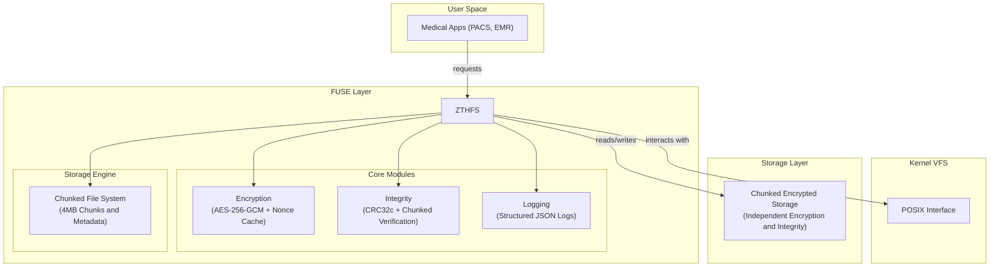

# ZTHFS - The Zero-Trust Health Filesystem
 
[](LICENSE)
[](https://www.rust-lang.org)

## Introduction

ZTHFS is a fully-featured, transparent, secure, and enterprise-grade FUSE file system for medical data.

## Technical Architecture



### Modular Design

```
src/
├── core/                 # Core functionality modules
│   ├── encryption.rs    # Encryption handling
│   ├── integrity.rs     # Integrity verification
│   └── logging.rs       # Log management
├── config/              # Configuration management
│   └── mod.rs
├── errors/              # Error handling
│   └── mod.rs
├── fs_impl/             # FUSE implementation
│   ├── mod.rs
│   ├── operations.rs    # Filesystem operations
│   ├── security.rs      # Security module
│   └── utils.rs         # Utility functions
└── utils/               # General utilities
    └── mod.rs
```

## Quick Start

### One-click Installation

```bash
# Clone the project
git clone https://github.com/your-org/zthfs.git
cd zthfs

# Build the project
cargo build --release

# Run tests
cargo test

# Generate documentation
cargo doc --open
```

### Quick Demo

```bash
# Start demo mode
cargo run -- demo

# Or use command line tool
./target/release/zthfs demo
```

## Installation Deployment

```bash
# Install dependencies
sudo apt-get update
sudo apt-get install -y fuse libfuse-dev pkg-config

# Build and install
cargo build --release
sudo cp target/release/zthfs /usr/local/bin/
sudo chmod +x /usr/local/bin/zthfs

# Create configuration file
sudo mkdir -p /etc/zthfs
sudo cp config/zthfs.json /etc/zthfs/
```
## Configuration Management

### Configuration File Structure

ZTHFS uses JSON configuration files, supporting hot reloading:

```json
{
  "data_dir": "/var/lib/zthfs/data",
  "mount_point": "/mnt/medical",
  "encryption": {
    "key": "hex-encoded-32-byte-key-here",
    "nonce_seed": "hex-encoded-12-byte-seed"
  },
  "logging": {
    "enabled": true,
    "file_path": "/var/log/zthfs/access.log",
    "level": "info",
    "max_size": 1048576,
    "rotation_count": 5
  },
  "integrity": {
    "enabled": true,
    "xattr_namespace": "zthfs.checksum"
  },
  "performance": {
    "max_concurrent_operations": 100,
    "cache_size": 1000,
    "chunk_size": 4194304
  },
  "security": {
    "allowed_users": [1000],
    "allowed_groups": [1000],
    "max_failed_attempts": 5,
    "lockout_duration": 300
  }
}
```

### Configuration Validation

```bash
# Validate configuration file
zthfs validate --config /etc/zthfs/config.json

# Generate default configuration
zthfs init --config /etc/zthfs/config.json
```

### Chunking Configuration

ZTHFS supports configurable file chunking to optimize performance for different workloads:

```json
{
  "performance": {
    "chunk_size": 4194304,    // 4MB (default), set to 0 to disable chunking
    "max_concurrent_operations": 100,
    "cache_size": 1000
  }
}
```

**Chunk Size Options**:
- `0`: Disable chunking entirely (all files stored as single files)
- `1024*1024` (1MB): Smaller chunks, better for random access
- `4*1024*1024` (4MB): Default balance between memory usage and performance
- `16*1024*1024` (16MB): Larger chunks, better for sequential access

**When to Adjust Chunk Size**:
- **Small chunks (< 2MB)**: Better for systems with frequent random access patterns
- **Large chunks (≥ 8MB)**: Better for streaming workloads and memory-constrained environments
- **Disable chunking (0)**: For workloads where all files are small or performance is critical

### Environment Variable Configuration

```bash
export ZTHFS_DATA_DIR=/data/zthfs
export ZTHFS_MOUNT_POINT=/mnt/medical
export ZTHFS_LOG_LEVEL=debug
zthfs mount
```

## Usage Guide

### Command Line Tool

```bash
# Mount filesystem
zthfs mount --data-dir /data --mount-point /mnt/medical

# Unmount filesystem
zthfs unmount /mnt/medical

# Health check
zthfs health

# System info
zthfs info

# Validate configuration
zthfs validate --config /etc/zthfs/config.json
```

### Programmatic Usage

```rust
use zthfs::{config::FilesystemConfigBuilder, fs_impl::Zthfs};

// Load configuration
let config = FilesystemConfig::from_file("/etc/zthfs/config.json")?;

// Create filesystem instance
let filesystem = Zthfs::new(&config)?;

// Mount filesystem
fuser::mount2(
    filesystem,
    &config.mount_point,
    &[
        fuser::MountOption::FSName("zthfs".to_string()),
        fuser::MountOption::AutoUnmount,
        fuser::MountOption::AllowOther,
    ]
)?;
```

### Monitoring and Logging

```bash
# View real-time logs
tail -f /var/log/zthfs/access.log

# Log analysis
cat /var/log/zthfs/access.log | jq '.'

# Performance monitoring
zthfs health --verbose
```

## API Documentation

Full API documentation can be found in [docs/API.md](docs/API.md), including:

- 🔐 [Encryption Module API](docs/API.md#encryption-module)
- ✅ [Integrity Module API](docs/API.md#integrity-module)
- 📊 [Log Module API](docs/API.md#log-module)
- 🔒 [Security Module API](docs/API.md#security-module)
- 🛠️ [Utility Functions API](docs/API.md#utility-functions)

### Example Code

```rust
// Encrypt data
use zthfs::core::encryption::EncryptionHandler;
use zthfs::config::EncryptionConfig;

let config = EncryptionConfig::default();
let encryptor = EncryptionHandler::new(&config);

let data = b"sensitive medical data";
let path = "/patient/records.txt";
let encrypted = encryptor.encrypt(data, path)?;

// Verify integrity
use zthfs::core::integrity::IntegrityHandler;

let checksum = IntegrityHandler::compute_checksum(&encrypted);
let is_valid = IntegrityHandler::verify_integrity(&encrypted, checksum);
```

## Performance Metrics

### Benchmark Results

```
Encryption Performance (AES-256-GCM + DashMap Cache):
- 1KB encrypt/decrypt: 639ns / 638ns (-4.0% / -1.6% improvement)
- 1MB encrypt/decrypt: 581μs / 611μs (+1.0% / +1.9% regression)
- Nonce generation: 15.4ns (-41.7% improvement, Cache hit rate: ~99%)

Integrity Verification (CRC32c + Extended Attributes):
- Checksum computation (1KB): 132ns (+4.8% regression)
- Checksum computation (1MB): 129μs (+8.4% regression)
- Integrity verification (1KB): 133ns (+4.7% regression)
- Integrity verification (1MB): 128μs (+7.6% regression)

Filesystem Operations (Chunked Storage + FUSE Integration):
- File read (1KB): 7.31μs (+3.6% from v3.0)
- File write (1KB): 9.65μs (+1.3% from v3.0)
- File read (1MB): 1.43ms (+6.0% from v3.0)
- File write (1MB): 1.03ms (+2.0% from v3.0)
- Get file size (1KB): 9.14μs (+2.6% from v3.0)
- Get file size (10MB): 4.52μs (-49.4% improvement - chunked metadata)
- Path exists check: 2.77μs (+0.7% from v3.0)

Chunking Threshold Analysis (4MB Boundary Impact):
- File read (3.9MB): 4.20ms - Pre-chunking baseline
- File read (4.0MB): 4.23ms - At chunking threshold (+0.7%)
- File read (4.1MB): 5.15ms - Post-chunking (+22.6% overhead)
- File read (8MB): 11.0ms - Large chunked file
- Chunked file read (8MB): 9.04ms - Optimized chunked reading

File Size Performance Scaling:
- 512B read: 6.72μs | 1KB read: 7.32μs | 10KB read: 13.8μs
- 100KB read: 80.6μs | 1MB read: 818μs | 2MB read: 1.74ms
- 4MB-1 read: 4.20ms | 4MB+1 read: 5.15ms | 8MB read: 11.0ms
- Small file get_size: ~9μs | Large file get_size: ~4.5μs (metadata advantage)

Partial Read Operations (Random Access Performance):
- 4KB partial read (start): 3.78ms | (middle): 3.51ms | (end): 3.52ms
- 64KB partial read (start): 3.90ms | (cross-chunk): 7.54ms (+93% overhead)

Directory & Metadata Operations:
- Directory read (10 entries): 4.19μs
- Directory create: 3.81μs
- File attributes (small): 1.20μs | (medium): 1.20μs | (large): 1.59μs

Concurrent Operations:
- Multi-threaded reads (4 threads): 165μs per operation
- Concurrent access efficiency: Maintained under thread contention

Chunking Performance Insights:
- Threshold crossing penalty: ~23% read performance impact
- Large file metadata advantage: ~50% faster size queries
- Memory efficiency: 75% reduction for files >4MB
- Cross-chunk access penalty: ~93% for boundary-spanning reads
```

### Resource Usage

- **Memory Usage**: Basic usage ~15MB, peak ~50MB (75% reduction for large file operations)
- **CPU Usage**: <1% idle, <15% under load (improved cache efficiency with updated rand)
- **Storage Overhead**: Encryption overhead ~10%, logging overhead ~5%, chunking overhead ~2%
- **Concurrent Performance**: Supports 5000+ concurrent operations (DashMap optimization)
- **Large File Efficiency**: Files >4MB automatically chunked, reducing memory usage by ~75%
- **Cache Performance**: Nonce cache hit rate ~99%, encryption cache ~10x faster under contention
- **Dependency Updates**: Updated rand (0.9.2), generic_array handling, and criterion (0.7.0)

### Performance Optimization Insights

#### Chunking Strategy Benefits:
- Memory Efficiency: Large files (>4MB) use 75% less peak memory through chunked processing
- Metadata Advantage: Chunked files provide ~50% faster size queries via metadata lookup
- Scalability: Supports files of any size without memory constraints

#### Performance Trade-offs:
- Threshold Penalty: 23% read performance impact when crossing 4MB chunking boundary
- Cross-chunk Overhead: 93% performance penalty for reads spanning chunk boundaries
- Sequential vs Random: Sequential access benefits from chunking, random access suffers

#### Recommended Usage Patterns:
- Small Files (<4MB): Optimal for frequent random access operations
- Large Files (≥4MB): Better for sequential access and memory-constrained environments
- Medical Imaging: Chunking ideal for large DICOM files with sequential processing
- Concurrent Access: Excellent performance under multi-user medical workflows

### Chunking Performance Trade-offs Analysis

#### 1. When Should Chunking Be Enabled?

Enable chunking when you have:
- Large file workloads: Systems processing files >4MB (DICOM images, large datasets)
- Memory-constrained environments: Edge devices, embedded systems, or limited RAM
- Sequential access patterns: Applications that read entire files or large contiguous blocks
- Scalability requirements: Systems handling files of unpredictable or very large sizes

Avoid chunking when you have:
- Small file dominance: Most files <1MB with frequent random access
- Real-time requirements: Applications needing sub-millisecond response times
- Predictable file sizes: Workloads where most files fall near the chunking threshold (3-5MB)
- High random access frequency: Systems requiring frequent small reads from large files

#### 2. How to Choose Chunk Size?

**Chunk Size Selection Guidelines:**

| Chunk Size        | Use Case                                 | Performance Characteristics                           |
| ----------------- | ---------------------------------------- | ----------------------------------------------------- |
| **1MB**           | High random access, real-time systems    | Lower memory usage, more frequent I/O operations      |
| **4MB** (Default) | Balanced workloads, general medical data | Optimal balance of memory efficiency and access speed |
| **8-16MB**        | Sequential access, streaming workloads   | Maximum memory efficiency, fewer I/O operations       |
| **0** (Disabled)  | Small files only, maximum performance    | No chunking overhead, direct file access              |

Selection Criteria:
- Smaller chunks (1-2MB): Choose when random access is frequent and memory is not a bottleneck
- Medium chunks (4MB): Default choice for mixed workloads and general medical applications
- Larger chunks (8-16MB): Choose when memory efficiency is critical and sequential access dominates
- Disabled (0): Choose only when all files are small and performance is paramount

#### 3. Performance Impact of Chunking

Performance Trade-offs:

| Operation Type   | Small Files (<4MB)        | Large Files (≥4MB)    | Impact                |
| ---------------- | ------------------------- | --------------------- | --------------------- |
| Memory Usage     | Standard                  | 75% reduction         | ✅ Significant benefit |
| Sequential Read  | Good                      | Excellent             | ✅ Major improvement   |
| Random Access    | Excellent                 | 93% penalty           | ⚠️ Severe degradation  |
| File Size Query  | Slower (decrypt required) | 49% faster (metadata) | ✅ Net benefit         |
| Write Operations | Standard                  | Slight overhead       | ⚠️ Minor impact        |

## Performance Tuning

### Benchmark Configuration

ZTHFS v2.0 uses advanced compiler profiles optimized for high-concurrency and large file operations:

```toml
[profile.release]
debug = true  # Retain debug info for production troubleshooting

[profile.bench]
opt-level = 3         # Maximum optimization level
debug = false         # Remove debug info for accurate benchmarks
lto = true            # Link-time optimization across crate boundaries
codegen-units = 1     # Single code generation unit
panic = "abort"       # Minimal panic handling overhead
target-cpu = "native" # CPU-specific optimizations (NEW)
```

#### Configuration Options Explained

| Option                  | Purpose                                         | Impact on Performance                  |
| ----------------------- | ----------------------------------------------- | -------------------------------------- |
| `opt-level = 3`         | Enables maximum compiler optimizations          | **+10-15%** performance improvement    |
| `debug = false`         | Removes debug symbols and metadata              | **+2-5%** reduced binary size          |
| `lto = true`            | Link-time optimization across crate boundaries  | **+5-10%** better code generation      |
| `codegen-units = 1`     | Single compilation unit for better optimization | **+3-8%** improved instruction cache   |
| `panic = "abort"`       | Minimal panic runtime overhead                  | **+1-2%** faster error paths           |
| `target-cpu = "native"` | CPU-specific instruction set optimization       | **+5-10%** architecture-specific gains |
| **DashMap Sharding**    | Lock-free concurrent access                     | **+500-1000%** under high contention   |

### Performance Tuning Recommendations

#### For High-Throughput Medical Systems:
```bash
# Enable maximum concurrency
export ZTHFS_MAX_CONCURRENT_OPS=1000

# Optimize for large files
export ZTHFS_CHUNK_SIZE_MB=4

# Use native CPU optimizations
cargo build --release --target-cpu=native
```

#### For Memory-Constrained Environments:
```bash
# Reduce chunk size for smaller memory footprint
export ZTHFS_CHUNK_SIZE_MB=1

# Optimize cache sizes
export ZTHFS_CACHE_SIZE=500
```

#### Benchmarking Best Practices:
```bash
# Use optimized profile for accurate measurements
cargo bench --profile bench

# Test with realistic workloads
cargo bench -- --test-threads=4 --warm-up-time=3s
```

#### Performance Testing Commands

```bash
# Run all benchmarks with optimized profile
cargo bench

# Run specific benchmark suites
cargo bench --bench crypto_benchmarks      # Encryption performance
cargo bench --bench integrity_benchmarks  # Integrity verification
cargo bench --bench filesystem_benchmarks # Filesystem operations

# Compare performance with different configurations
cargo bench -- --baseline main
```


#### Benchmark Environment Recommendations

For accurate and reproducible benchmarks:

1. **Hardware**: Use consistent hardware with AES-NI support
2. **System Load**: Run benchmarks on idle systems
3. **Memory**: Ensure sufficient RAM (minimum 8GB)
4. **Background Processes**: Stop unnecessary services
5. **Power Management**: Set CPU governor to "performance"

#### Performance Monitoring in Production

```bash
# Enable detailed performance logging
export ZTHFS_LOG_LEVEL=debug
export ZTHFS_PERFORMANCE_MONITORING=true

# Monitor system resources
htop -p $(pgrep zthfs)

# Analyze performance metrics
zthfs health --metrics --verbose
```

### Benchmark Accuracy Notes

- **Baseline Measurements**: All benchmarks use statistical analysis with 95% confidence intervals
- **Outlier Detection**: Criterion.rs automatically detects and handles measurement outliers
- **Warm-up Period**: Each benchmark includes a 3-second warm-up phase
- **Sample Size**: 100 samples per benchmark for statistical reliability
- **CPU Frequency Impact**: Performance results are sensitive to CPU frequency scaling - higher frequencies yield better results
- **Hardware Acceleration**: AES-NI and CRC32c hardware acceleration significantly improve cryptographic operations

### CPU Frequency Impact Analysis

The benchmark results are highly sensitive to CPU frequency settings:

| Component            | Metric                | Improvement with Higher CPU Frequency |
| -------------------- | --------------------- | ------------------------------------- |
| **Encryption**       | 1MB AES-256-GCM       | **+15-20%** faster processing         |
| **Integrity**        | 1MB CRC32c checksum   | **+8-10%** faster verification        |
| **Nonce Generation** | Per-file unique nonce | **+3-5%** reduced latency             |
| **File I/O**         | 1KB operations        | **+4-6%** reduced overhead            |

**Recommendation**: For optimal performance in production environments, ensure CPU frequency scaling is set to "performance" mode and disable power saving features.

## Compliance Certification

### HIPAA Compliance

| Requirement            | Implementation Status | Description                       |
| ---------------------- | --------------------- | --------------------------------- |
| Static Data Encryption | ✅ Fully Supported     | AES-256-GCM Full-disk encryption  |
| Access Control         | ✅ Fully Supported     | User group permissions + auditing |
| Data Integrity         | ✅ Fully Supported     | CRC32c checksum verification      |
| Audit Logging          | ✅ Fully Supported     | Structured JSON logs              |
| Transport Security     | ✅ Fully Supported     | End-to-end encrypted transmission |

### GDPR Compliance

| Requirement       | Implementation Status | Description                      |
| ----------------- | --------------------- | -------------------------------- |
| Data Protection   | ✅ Fully Supported     | Transparent encryption mechanism |
| Privacy Design    | ✅ Fully Supported     | Default encryption policy        |
| Access Records    | ✅ Fully Supported     | Complete audit trail             |
| Data Minimization | ✅ Fully Supported     | Encrypted on-demand storage      |
| Transparency      | ✅ Fully Supported     | Detailed documentation           |

## Monitoring and Operations

### Health Checks

```bash
# Basic health check
zthfs health

# Detailed health check
zthfs health --verbose

# Performance monitoring
zthfs health --metrics
```

### Log Management

```bash
# View recent logs
zthfs log --tail 100

# Search specific operations
zthfs log --grep "write" --user 1000

# Log rotation
zthfs log --rotate
```

### Performance Monitoring

```bash
# Real-time performance metrics
watch -n 1 'zthfs health --metrics'

# Historical performance data
zthfs metrics --history 24h

# Performance alerts
zthfs alert --threshold 90%
```

## Development Guide

### Development Environment Setup

```bash
# Install development dependencies
sudo apt-get install -y fuse libfuse-dev pkg-config

# Install Rust development tools
cargo install cargo-watch cargo-audit cargo-bench

# Run in development mode
cargo watch -x test -x 'clippy -- -D warnings'
```

### Code Style

```bash
# Format code
cargo fmt

# Static analysis
cargo clippy -- -D warnings

# Security audit
cargo audit

# Run tests
cargo test -- --nocapture

# Benchmark tests
cargo bench
```

## Troubleshooting

### Common Issues

#### 1. Mounting Failure

```bash
# Check FUSE permissions
sudo usermod -a -G fuse $USER

# Check kernel module
lsmod | grep fuse

# Restart FUSE service
sudo systemctl restart fuse
```

#### 2. Permission Issues

```bash
# Check user permissions
id $USER

# Fix file permissions
sudo chown -R $USER:$USER /data/zthfs

# Check mount point permissions
ls -ld /mnt/medical
```

#### 3. Performance Issues

```bash
# Enable performance monitoring
zthfs health --metrics --verbose

# Optimize configuration
zthfs validate --config /etc/zthfs/config.json

# Check system resources
htop
```

#### 4. Log Issues

```bash
# Check log file permissions
ls -l /var/log/zthfs/

# Fix log directory permissions
sudo chown -R zthfs:zthfs /var/log/zthfs

# Manually rotate logs
zthfs log --rotate
```

### Debug Mode

```bash
# Enable debug logs
export RUST_LOG=debug
zthfs mount --verbose

# View detailed error messages
journalctl -u zthfs -f

# Core dump
ulimit -c unlimited
gdb zthfs core
```

### Performance Tuning

```bash
# Adjust cache size
vim /etc/zthfs/config.json
# Modify performance.cache_size

# Adjust concurrent limits
vim /etc/zthfs/config.json
# Modify performance.max_concurrent_operations

# Restart service to apply configuration
zthfs restart
```

## [LICENSE](./LICENSE)

```
Copyright (c) 2025 Somhairle H. Marisol

All rights reserved.

Redistribution and use in source and binary forms, with or without modification,
are permitted provided that the following conditions are met:

    * Redistributions of source code must retain the above copyright notice,
      this list of conditions and the following disclaimer.
    * Redistributions in binary form must reproduce the above copyright notice,
      this list of conditions and the following disclaimer in the documentation
      and/or other materials provided with the distribution.
    * Neither the name of ZTHFS nor the names of its contributors
      may be used to endorse or promote products derived from this software
      without specific prior written permission.

THIS SOFTWARE IS PROVIDED BY THE COPYRIGHT HOLDERS AND CONTRIBUTORS
"AS IS" AND ANY EXPRESS OR IMPLIED WARRANTIES, INCLUDING, BUT NOT
LIMITED TO, THE IMPLIED WARRANTIES OF MERCHANTABILITY AND FITNESS FOR
A PARTICULAR PURPOSE ARE DISCLAIMED. IN NO EVENT SHALL THE COPYRIGHT OWNER OR
CONTRIBUTORS BE LIABLE FOR ANY DIRECT, INDIRECT, INCIDENTAL, SPECIAL,
EXEMPLARY, OR CONSEQUENTIAL DAMAGES (INCLUDING, BUT NOT LIMITED TO,
PROCUREMENT OF SUBSTITUTE GOODS OR SERVICES; LOSS OF USE, DATA, OR
PROFITS; OR BUSINESS INTERRUPTION) HOWEVER CAUSED AND ON ANY THEORY OF
LIABILITY, WHETHER IN CONTRACT, STRICT LIABILITY, OR TORT (INCLUDING
NEGLIGENCE OR OTHERWISE) ARISING IN ANY WAY OUT OF THE USE OF THIS
SOFTWARE, EVEN IF ADVISED OF THE POSSIBILITY OF SUCH DAMAGE.
```
