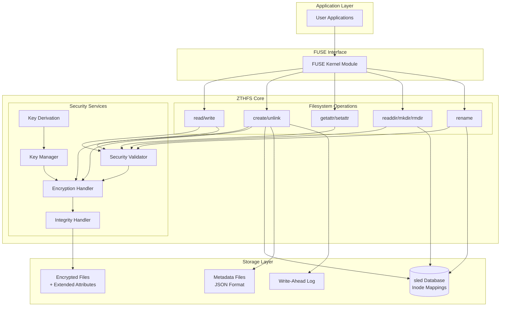
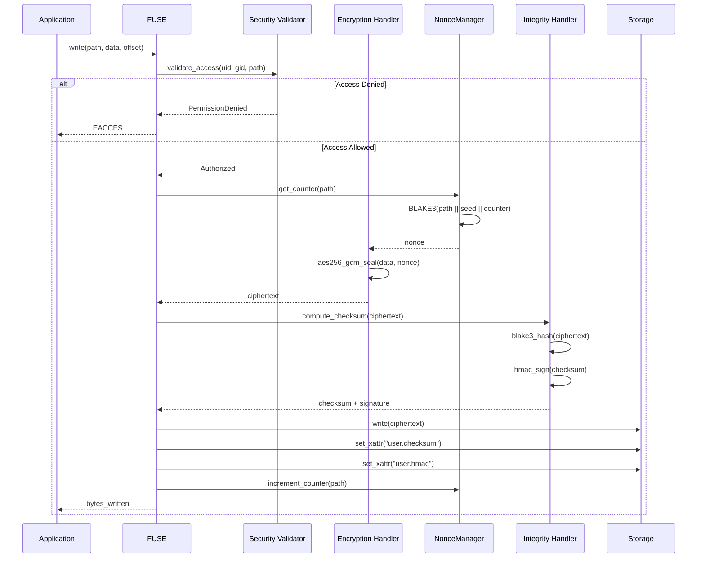
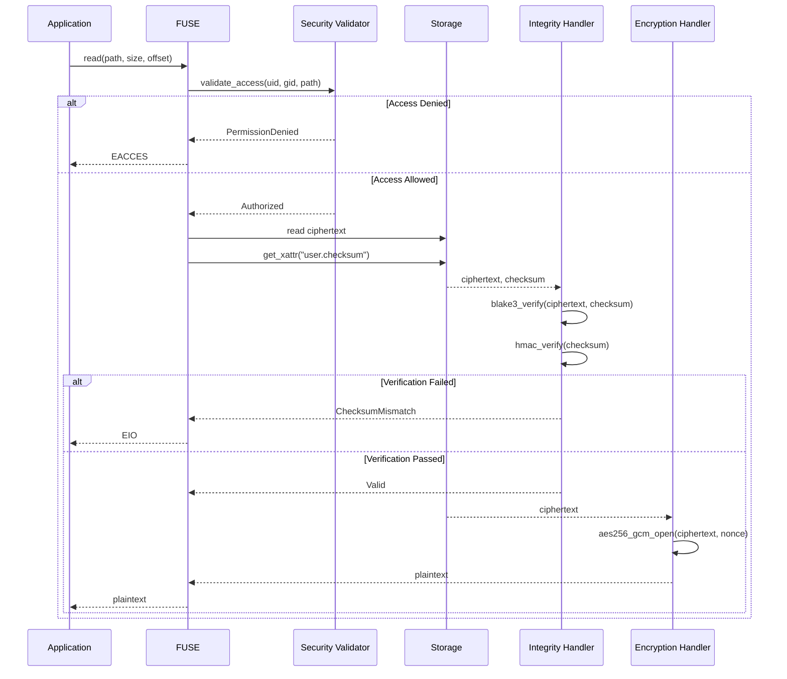
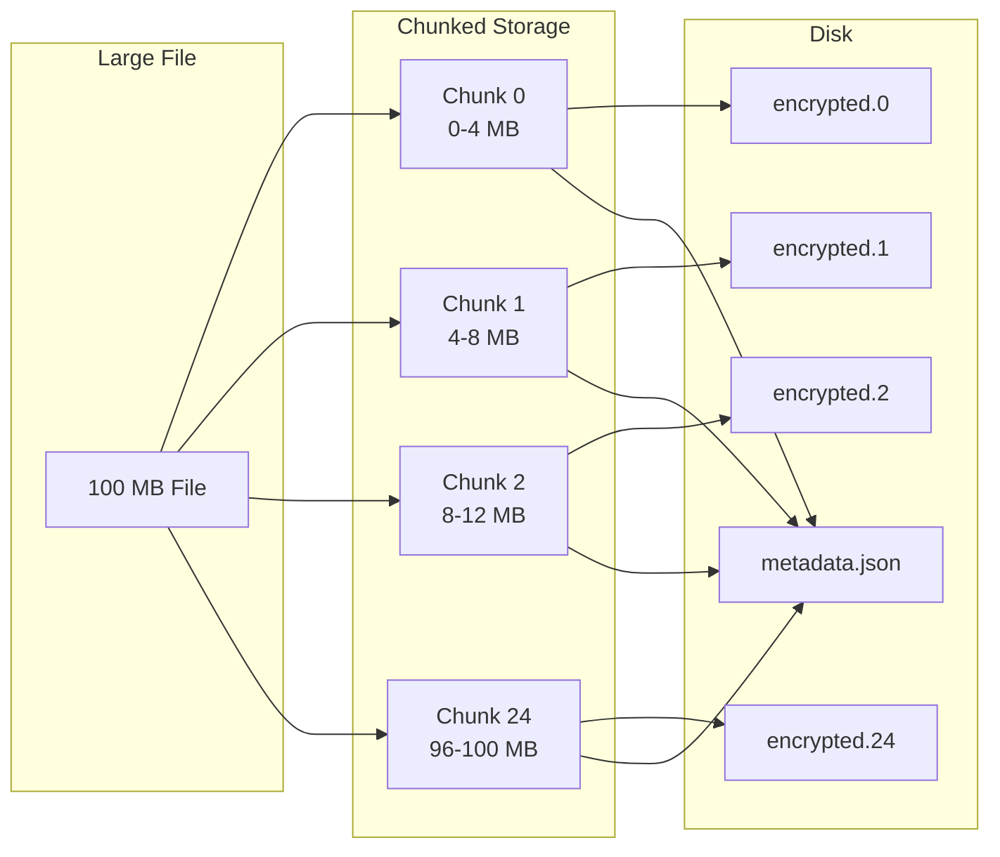
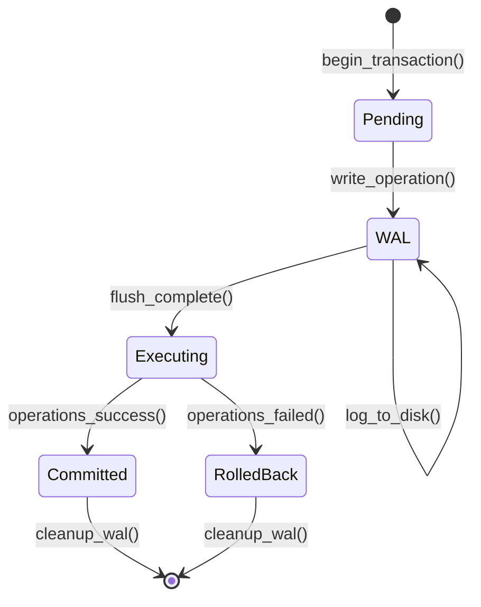

# ZTHFS - Zero-Trust Healthcare Filesystem

[中文README](README_zh.md) | English

> **NOTICE: This is a proof-of-concept (PoC) project.** While the cryptographic core and FUSE operations are implemented and tested, certain features have simplified implementations that may not be suitable for production use without further hardening.

[](LICENSE)
[](https://www.rust-lang.org)
[](coverage/tarpaulin-report.html)
[](https://github.com/somhairle/zthfs)

## Abstract

ZTHFS is a FUSE-based encrypted filesystem providing transparent encryption, integrity verification, and access control for sensitive data storage. The system implements AES-256-GCM encryption with counter-based nonce management, BLAKE3 integrity verification with optional HMAC signing, and a zero-trust security model where all users—including root—require explicit authorization.

## System Architecture

The system adopts a layered architecture with clear separation of concerns:



## Data Flow

### Write Operation



### Read Operation



## Cryptographic Design

### Encryption

ZTHFS employs AES-256-GCM for authenticated encryption. The critical security property—nonce uniqueness—is enforced through a counter-based scheme where each file maintains a persistent counter stored as an extended attribute.

```rust
use zthfs::{
    core::encryption::{EncryptionHandler, NonceManager},
    config::EncryptionConfig,
};

// Production deployment configuration
let config = EncryptionConfig::random()?;
let nonce_manager = NonceManager::new(data_dir.into());
let handler = EncryptionHandler::with_nonce_manager(&config, Arc::new(nonce_manager));

// Per-file unique nonce derived from:
// nonce = BLAKE3(path || nonce_seed || counter)
let encrypted = handler.encrypt(plaintext, "/path/to/file")?;
```

**Nonce uniqueness requirement**: GCM mode nonce reuse enables plaintext recovery through XOR analysis of ciphertexts encrypted with the same key and nonce. The counter-based approach guarantees uniqueness across all encryption operations for a given file path.

### Integrity Verification

The system provides two levels of integrity protection:

1. **BLAKE3 checksums**: Cryptographic hash of encrypted data stored as extended attributes
2. **HMAC-SHA256 signing**: Optional signature to prevent checksum tampering by attackers with disk write access

```rust
use zthfs::{
    core::integrity::IntegrityHandler,
    config::IntegrityConfig,
};

// With HMAC signing for tamper detection
let config = IntegrityConfig::with_hmac_signing(key, hmac_key);
let checksum = IntegrityHandler::compute_checksum(&ciphertext, "blake3", &config.key)?;
let signature = IntegrityHandler::compute_hmac_signature(&checksum, &config.hmac_key)?;
```

### Key Derivation

Passphrase-protected key storage uses Argon2id, a memory-hard key derivation function resistant to GPU and ASIC attacks. The default parameters follow OWASP recommendations for interactive logins:

| Parameter | Value | Description |
|-----------|-------|-------------|
| Memory Cost | 64 MiB | Memory required per iteration |
| Time Cost | 3 | Number of iterations |
| Parallelism | 4 | Degree of parallelism |
| Salt Length | 16 bytes | Cryptographically random salt |

```rust
use zthfs::key_derivation::{KeyDerivation, KeyDerivationConfig};

let config = KeyDerivationConfig::high_security();
let master_key = KeyDerivation::derive_key("passphrase", &config)?;
```

## Access Control

The zero-trust security model requires all users—including root—to satisfy three independent conditions:

1. **Whitelist membership**: User or group must appear in the explicit allowlist
2. **POSIX permissions**: Standard rwx bits must grant the requested operation
3. **Audit logging**: All access attempts are logged at appropriate severity levels

```rust
use zthfs::fs_impl::security::SecurityValidator;

// Zero-trust mode (default): root has no special privileges
let validator = SecurityValidator::new(config);

// Legacy mode: root bypasses permission checks (not recommended)
let validator = SecurityValidator::with_legacy_root(config);
```

## Storage Organization

```
/data/
├── zthfs.db                    # sled database: inode ↔ path mappings
├── inodes/                      # Encrypted file storage
│   └── {inode_hash}/
│       ├── data.0              # Chunk 0 (4 MB default)
│       ├── data.1              # Chunk 1
│       ├── ...
│       └── metadata.json       # Chunk metadata
├── keys/
│   └── master.key.enc          # Encrypted master key
├── wal/
│   └── {transaction_id}.wal    # Write-ahead log entries
└── zthfs.log                    # Audit log
```

## Chunked File Storage

Files exceeding the configured chunk size (default: 4 MB) are split into chunks. This design enables:

- **Efficient partial writes**: Only modified chunks are re-encrypted
- **Parallel I/O**: Chunks can be read/written concurrently
- **Memory efficiency**: Operations need not load entire files into memory



## Transaction Management

Atomic operations are guaranteed through write-ahead logging (WAL):



On startup, the WAL is scanned for incomplete transactions which are automatically rolled back, ensuring filesystem consistency after crashes.

## Configuration

The filesystem accepts a TOML configuration file:

```toml
[data_dir]
path = "/var/lib/zthfs"

[encryption]
algorithm = "aes256-gcm"
key_size = 32
nonce_seed = "base64-encoded-csprng-seed"

[integrity]
algorithm = "blake3"
enable_hmac = true

[security]
zero_trust_root = true
allowed_users = ["alice", "bob"]
allowed_groups = ["medical-team"]
max_failed_attempts = 3
lockout_duration = 3600

[key_derivation]
algorithm = "argon2id"
memory_cost = 65536    # 64 MiB
time_cost = 3
parallelism = 4

[performance]
chunk_size = 4194304   # 4 MB
cache_size = 256
```

## Implementation Status

| Module | Status | Description |
|--------|--------|-------------|
| Encryption | Complete | AES-256-GCM with NonceManager |
| Integrity | Complete | BLAKE3 + HMAC-SHA256 |
| Security | Complete | Zero-trust access control |
| Key Management | Complete | File-based storage with rotation |
| Key Derivation | Complete | Argon2id KDF |
| FUSE Operations | Complete | All 14 operations implemented |
| HSM/KMS Backend | Planned | Hardware security module integration |
| Distributed Storage | Planned | Multi-node replication |

## Testing

For comprehensive testing documentation, see [TESTING.md](docs/TESTING.md).

```bash
# Unit tests
cargo test --lib

# Integration tests
cargo test --workspace

# Property-based tests (256 cases per property)
cargo test --lib property_tests

# Coverage analysis
cargo tarpaulin --workspace --exclude-files '*/tests/*' --out Html

# Linting
cargo clippy --all-targets
```

Current test coverage: **64.89%** (1571/2421 lines)

### Test Categories

- **Unit tests**: Fast, isolated tests for individual functions and modules
- **Integration tests**: Full FUSE filesystem tests with real I/O operations
- **Property-based tests**: Hypothesis-based tests that verify invariants across random inputs
- **Stress tests**: Performance and reliability tests with large files and many operations
- **Concurrent access tests**: Thread-safety verification for parallel operations

See [TESTING.md](docs/TESTING.md) for detailed documentation on running and writing tests.

## Security Considerations

### Threat Model

The system mitigates the following threats:

| Threat | Mitigation |
|--------|------------|
| Unauthorized data access | AES-256-GCM encryption + access control |
| Data tampering | BLAKE3 checksums + HMAC signatures |
| Nonce reuse attacks | Counter-based nonce generation |
| Password cracking | Argon2id with OWASP parameters |
| Privilege escalation | Zero-trust root model |
| Timing attacks | Constant-time comparisons |

### Known Limitations

1. **Metadata leakage**: File sizes, access patterns, and directory structure remain visible
2. **Single point of failure**: Loss of the master key renders data permanently inaccessible
3. **Performance overhead**: Encryption/integrity operations add latency to all I/O
4. **Simplified permission checking**: The `access()` FUSE operation currently validates only whether a user is in the configured allowlist (`allowed_users`/`allowed_groups`). It does **not** enforce per-file permissions—authorized users have full read/write/execute access to all files. The `_mask` parameter (R_OK/W_OK/X_OK) is accepted but not evaluated against individual file permissions. This is sufficient for a trusted-user environment but inadequate for multi-tenant scenarios requiring file-level access control.
5. **Passive flush handler**: The `flush()` operation is a stub that returns success without performing any synchronization. Data integrity is maintained through explicit `sync_all()` calls during file creation, but the flush callback provides no additional guarantees. In production, this should sync pending writes and handle dirty buffers.

**TODO for Production Readiness:**

| Component | Current Behavior | Required for Production |
|-----------|------------------|-------------------------|
| `access()` | Allowlist check only; ignores `_mask` | Per-file permission validation |
| `flush()` | No-op stub | Explicit data sync, buffer flush |
| Permission model | All-or-nothing per user | Unix-like rwx per file |
| Audit logging | Basic logging present | Structured, tamper-evident audit |

## References

- NIST Special Publication 800-38D: Recommendation for Block Cipher Modes of Operation
- OWASP Argon2id Guidelines: https://cheatsheetseries.owasp.org/cheatsheets/Password_Storage_Cheat_Sheet.html
- FUSE Documentation: https://libfuse.github.io/

## License

BSD 3-Clause - see [LICENSE](LICENSE)

Copyright (c) 2025 Somhairle H. Marisol
