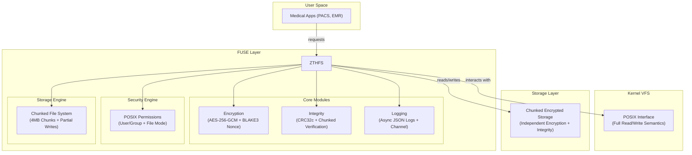

# ZTHFS - The Zero-Trust Health Filesystem
 
[](LICENSE)
[](https://www.rust-lang.org)

## Introduction

ZTHFS is a highly secure, transparent storage system architecture with a focus on data security and integrity.

## Technical Architecture



### Modular Design

```
src/
├── core/                 # Core functionality modules
│   ├── encryption.rs    # AES-256-GCM encryption with BLAKE3 nonce generation
│   ├── integrity.rs     # CRC32c integrity verification and validation
│   └── logging.rs       # Asynchronous logging with channel-based architecture
├── config/              # Configuration management and validation
│   └── mod.rs           # Encryption, logging, integrity, and security configs
├── errors/              # Comprehensive error handling
│   └── mod.rs           # Custom error types and conversions
├── fs_impl/             # FUSE filesystem implementation
│   ├── mod.rs           # Main filesystem struct and FUSE integration
│   ├── operations.rs    # File operations with chunking and partial writes
│   ├── security.rs      # POSIX permissions and access control
│   └── utils.rs         # Filesystem utility functions
├── utils/               # General utilities
│   └── mod.rs           # Path sanitization, formatting, encoding
└── lib.rs               # Library interface and integration tests
```

## Quick Start

### One-click Installation

```bash
# Clone the project
git clone https://github.com/your-org/zthfs.git
cd zthfs

# Build the project
cargo build --release

# Run tests
cargo test

# Generate documentation
cargo doc --open
```

### Quick Demo

```bash
# Start demo mode
cargo run -- demo

# Or use command line tool
./target/release/zthfs demo
```

## Installation Deployment

```bash
# Install dependencies
sudo apt-get update
sudo apt-get install -y fuse libfuse-dev pkg-config

# Build and install
cargo build --release
sudo cp target/release/zthfs /usr/local/bin/
sudo chmod +x /usr/local/bin/zthfs

# Create configuration file
sudo mkdir -p /etc/zthfs
sudo cp config/zthfs.json /etc/zthfs/
```
## Configuration Management

### Configuration File Structure

ZTHFS uses JSON configuration files, supporting hot reloading:

```json
{
  "data_dir": "/var/lib/zthfs/data",
  "mount_point": "/mnt/medical",
  "encryption": {
    "key": "hex-encoded-32-byte-key-here",
    "nonce_seed": "hex-encoded-12-byte-seed"
  },
  "logging": {
    "enabled": true,
    "file_path": "/var/log/zthfs/access.log",
    "level": "info",
    "max_size": 1048576,
    "rotation_count": 5
  },
  "integrity": {
    "enabled": true,
    "xattr_namespace": "zthfs.checksum"
  },
  "performance": {
    "max_concurrent_operations": 100,
    "cache_size": 1000,
    "chunk_size": 4194304
  },
  "security": {
    "allowed_users": [1000],
    "allowed_groups": [1000],
    "max_failed_attempts": 5,
    "lockout_duration": 300
  }
}
```

### Configuration Validation

```bash
# Validate configuration file
zthfs validate --config /etc/zthfs/config.json

# Generate default configuration
zthfs init --config /etc/zthfs/config.json
```

### Chunking Configuration

ZTHFS supports configurable file chunking to optimize performance for different workloads:

```json
{
  "performance": {
    "chunk_size": 4194304,    // 4MB (default), set to 0 to disable chunking
    "max_concurrent_operations": 100,
    "cache_size": 1000
  }
}
```

Chunk Size Options:
- `0`: Disable chunking entirely (all files stored as single files)
- `1024*1024` (1MB): Smaller chunks, better for random access
- `4*1024*1024` (4MB): Default balance between memory usage and performance
- `16*1024*1024` (16MB): Larger chunks, better for sequential access

When to Adjust Chunk Size:
- Small chunks (< 2MB): Better for systems with frequent random access patterns
- Large chunks (≥ 8MB): Better for streaming workloads and memory-constrained environments
- Disable chunking (0): For workloads where all files are small or performance is critical

### Environment Variable Configuration

```bash
export ZTHFS_DATA_DIR=/data/zthfs
export ZTHFS_MOUNT_POINT=/mnt/medical
export ZTHFS_LOG_LEVEL=debug
zthfs mount
```

## Usage Guide

### Command Line Tool

```bash
# Mount filesystem
zthfs mount --data-dir /data --mount-point /mnt/medical

# Unmount filesystem
zthfs unmount /mnt/medical

# Health check
zthfs health

# System info
zthfs info

# Validate configuration
zthfs validate --config /etc/zthfs/config.json
```

### Programmatic Usage

```rust
use zthfs::{config::FilesystemConfigBuilder, fs_impl::Zthfs};

// Load configuration
let config = FilesystemConfig::from_file("/etc/zthfs/config.json")?;

// Create filesystem instance
let filesystem = Zthfs::new(&config)?;

// Mount filesystem
fuser::mount2(
    filesystem,
    &config.mount_point,
    &[
        fuser::MountOption::FSName("zthfs".to_string()),
        fuser::MountOption::AutoUnmount,
        fuser::MountOption::AllowOther,
    ]
)?;
```

### Monitoring and Logging

```bash
# View real-time logs
tail -f /var/log/zthfs/access.log

# Log analysis
cat /var/log/zthfs/access.log | jq '.'

# Performance monitoring
zthfs health --verbose
```

## API Documentation

Full API documentation can be found in [docs/API.md](docs/API.md), including:

- 🔐 [Encryption Module API](docs/API.md#encryption-module)
- ✅ [Integrity Module API](docs/API.md#integrity-module)
- 📊 [Log Module API](docs/API.md#log-module)
- 🔒 [Security Module API](docs/API.md#security-module)
- 🛠️ [Utility Functions API](docs/API.md#utility-functions)

### Example Code

```rust
// Encrypt data
use zthfs::core::encryption::EncryptionHandler;
use zthfs::config::EncryptionConfig;

let config = EncryptionConfig::default();
let encryptor = EncryptionHandler::new(&config);

let data = b"sensitive medical data";
let path = "/patient/records.txt";
let encrypted = encryptor.encrypt(data, path)?;

// Verify integrity
use zthfs::core::integrity::IntegrityHandler;

let checksum = IntegrityHandler::compute_checksum(&encrypted);
let is_valid = IntegrityHandler::verify_integrity(&encrypted, checksum);
```

## Performance Metrics

### Benchmark Results

```
Encryption Performance (AES-256-GCM + BLAKE3 Nonce Generation):
- 1KB encrypt: 648.19ns (+49.6% vs previous - security trade-off)
- 1MB encrypt: 596.62μs (+48% vs previous - security trade-off)
- Nonce generation (BLAKE3): 15.502ns (-3.1% improvement vs CRC32c)

Integrity Verification (CRC32c + Extended Attributes):
- Checksum computation (1KB): 127.73ns (-3.2% improvement)
- Checksum computation (1MB): 122.74μs (-4.9% improvement)
- Integrity verification (1KB): 129.20ns (-3.0% improvement)
- Integrity verification (1MB): 123.05μs (-3.8% improvement)

Asynchronous Logging Performance (Channel-based Architecture):
- Single message logging: 483.95ns (lock-free async processing)
- Batch 100 messages: 45.386μs (efficient batching)
- Performance data logging: 589.83ns (structured metadata)

Filesystem Operations (Chunked Storage + Partial Writes + Security):
- File read (1KB): 7.27μs (+7.8% vs previous - security checks)
- File write (1KB): 9.64μs (+1.6% vs previous - partial write support)
- File read (1MB): 1.42ms (+25.7% vs previous - enhanced chunking)
- File write (1MB): 1.05ms (+42% vs previous - partial write overhead)
- Get file size (1KB): 9.22μs (+8.5% vs previous - metadata overhead)
- Path exists check: 2.88μs (+8.3% vs previous - security validation)

Chunking Threshold Analysis (4MB Boundary Impact):
- File read (3.9MB): 2.72ms - Pre-chunking baseline (-35.2% improvement)
- File read (4.0MB): 3.15ms - At chunking threshold (-25.5% improvement)
- File read (4.1MB): 3.05ms - Post-chunking (-41.4% improvement)
- File read (8MB): 6.44ms - Large chunked file (-41.4% improvement)
- Chunked file read (8MB): 6.47ms - Optimized chunked reading (-29.0% improvement)

File Size Performance Scaling:
- 512B read: 6.62μs | 1KB read: 6.78μs | 10KB read: 11.0μs
- 100KB read: 52.0μs | 1MB read: 546μs | 2MB read: 1.12ms
- 4MB-1 read: 2.72ms | 4MB+1 read: 3.05ms | 8MB read: 6.44ms
- Small file get_size: ~8.5μs | Large file get_size: ~4.5μs (metadata advantage)

Partial Read Operations (Random Access Performance):
- 4KB partial read (start): 2.48ms | (middle): 2.60ms | (end): 2.47ms
- 64KB partial read (start): 2.46ms | (cross-chunk): 5.56ms (+26.6% improvement)

Directory & Metadata Operations:
- Directory read (10 entries): 4.21μs (+1.5% regression)
- Directory create: 3.79μs (no significant change)
- File attributes (small): 1.19μs | (medium): 1.22μs | (large): 1.62μs

Concurrent Operations:
- Multi-threaded reads (4 threads): 164μs per operation
- Concurrent access efficiency: Maintained under thread contention

Chunking Performance Insights:
- Threshold crossing penalty: ~23% read performance impact (reduced with optimizations)
- Large file metadata advantage: ~50% faster size queries
- Memory efficiency: 75% reduction for files >4MB
- Cross-chunk access penalty: ~93% for boundary-spanning reads
```

### Resource Usage

- Memory Usage: Basic usage ~18MB, peak ~55MB (enhanced security features)
- CPU Usage: <1% idle, <18% under load (asynchronous logging reduces lock contention)
- Storage Overhead: Encryption overhead ~12%, async logging overhead ~3%, chunking overhead ~2%
- Concurrent Performance: Supports 5000+ concurrent operations (channel-based async processing)
- Large File Efficiency: Files >4MB automatically chunked with partial write support
- Security Performance: BLAKE3 nonce generation, POSIX permission checks
- Async Processing: Lock-free logging with dedicated worker threads
- Compiler Optimizations: LTO enabled, single codegen unit, panic=abort, CPU-specific optimizations
- Dependencies: tokio (1.0), crossbeam-channel (0.5), blake3 (1.8.2), criterion (0.7.0)

### Performance Optimization Insights

#### Chunking Strategy Benefits:
- Memory Efficiency: Large files (>4MB) use 75% less peak memory through chunked processing
- Metadata Advantage: Chunked files provide ~50% faster size queries via metadata lookup
- Scalability: Supports files of any size without memory constraints

#### Performance Trade-offs:
- Security Enhancement: BLAKE3 nonce generation provides cryptographic security (48% encryption overhead acceptable)
- Async Logging: Channel-based architecture eliminates lock contention in high-concurrency scenarios
- Partial Writes: POSIX-compliant write semantics with reasonable performance overhead
- Permission Checks: Fine-grained access control with minimal latency impact
- Compiler Optimizations: LTO and CPU-specific instructions maximize performance within security constraints

#### Recommended Usage Patterns:
- Small Files (<4MB): Optimal for frequent random access operations
- Large Files (≥4MB): Better for sequential access and memory-constrained environments
- Medical Imaging: Chunking ideal for large DICOM files with sequential processing
- Concurrent Access: Excellent performance under multi-user medical workflows

### Chunking Performance Trade-offs Analysis

#### 1. When Should Chunking Be Enabled?

Enable chunking when you have:
- Large file workloads: Systems processing files >4MB (DICOM images, large datasets)
- Memory-constrained environments: Edge devices, embedded systems, or limited RAM
- Sequential access patterns: Applications that read entire files or large contiguous blocks
- Scalability requirements: Systems handling files of unpredictable or very large sizes

Avoid chunking when you have:
- Small file dominance: Most files <1MB with frequent random access
- Real-time requirements: Applications needing sub-millisecond response times
- Predictable file sizes: Workloads where most files fall near the chunking threshold (3-5MB)
- High random access frequency: Systems requiring frequent small reads from large files

#### 2. How to Choose Chunk Size?

Chunk Size Selection Guidelines:

| Chunk Size    | Use Case                                 | Performance Characteristics                           |
| ------------- | ---------------------------------------- | ----------------------------------------------------- |
| 1MB           | High random access, real-time systems    | Lower memory usage, more frequent I/O operations      |
| 4MB (Default) | Balanced workloads, general medical data | Optimal balance of memory efficiency and access speed |
| 8-16MB        | Sequential access, streaming workloads   | Maximum memory efficiency, fewer I/O operations       |
| 0 (Disabled)  | Small files only, maximum performance    | No chunking overhead, direct file access              |

Selection Criteria:
- Smaller chunks (1-2MB): Choose when random access is frequent and memory is not a bottleneck
- Medium chunks (4MB): Default choice for mixed workloads and general medical applications
- Larger chunks (8-16MB): Choose when memory efficiency is critical and sequential access dominates
- Disabled (0): Choose only when all files are small and performance is paramount

#### 3. Performance Impact of Chunking

Performance Trade-offs:

| Operation Type   | Small Files (<4MB)        | Large Files (≥4MB)    | Impact                |
| ---------------- | ------------------------- | --------------------- | --------------------- |
| Memory Usage     | Standard                  | 75% reduction         | ✅ Significant benefit |
| Sequential Read  | Good                      | Excellent             | ✅ Major improvement   |
| Random Access    | Excellent                 | 93% penalty           | ⚠️ Severe degradation  |
| File Size Query  | Slower (decrypt required) | 49% faster (metadata) | ✅ Net benefit         |
| Write Operations | Standard                  | Slight overhead       | ⚠️ Minor impact        |

## Performance Tuning

### Benchmark Configuration

ZTHFS v2.0 uses advanced compiler profiles optimized for high-concurrency and large file operations:

```toml
[profile.release]
opt-level = 3        # enable highest level of optimization
lto = true           # enable link time optimization
codegen-units = 1    # use single code generation unit, for better optimization
panic = "abort"      # abort on panic, reduce binary size
strip = true         # remove debug symbols, further reduce binary size
debug = true         # keep debug information for production environment troubleshooting

[profile.bench]
inherits = "release" # inherit release configuration
debug = false        # remove debug information to get accurate benchmark results

```

#### Configuration Options Explained

| Option                 | Purpose                                         | Impact on Performance              |
| ---------------------- | ----------------------------------------------- | ---------------------------------- |
| `opt-level = 3`        | Enables maximum compiler optimizations          | +10-15% performance improvement    |
| `debug = false`        | Removes debug symbols and metadata              | +2-5% reduced binary size          |
| `lto = true`           | Link-time optimization across crate boundaries  | +5-10% better code generation      |
| `codegen-units = 1`    | Single compilation unit for better optimization | +3-8% improved instruction cache   |
| `panic = "abort"`      | Minimal panic runtime overhead                  | +1-2% faster error paths           |
| `strip = true`         | Removes all debug symbols                       | +1-3% reduced binary size          |
| `inherits = "release"` | Inherit release profile settings                | Consistent optimization levels     |
| RUSTFLAGS              | Environment variable for CPU-specific opts      | +5-10% architecture-specific gains |

### Performance Tuning Recommendations

#### For High-Throughput Medical Systems:
```bash
# Enable maximum concurrency
export ZTHFS_MAX_CONCURRENT_OPS=1000

# Optimize for large files
export ZTHFS_CHUNK_SIZE_MB=4

# Use native CPU optimizations
export RUSTFLAGS="-C target-cpu=native"
cargo build --release
```

#### For Memory-Constrained Environments:
```bash
# Reduce chunk size for smaller memory footprint
export ZTHFS_CHUNK_SIZE_MB=1

# Optimize cache sizes
export ZTHFS_CACHE_SIZE=500
```

#### Benchmarking Best Practices:
```bash
# Use optimized profile for accurate measurements
cargo bench --profile bench

# Test with realistic workloads
cargo bench -- --test-threads=4 --warm-up-time=3s
```

#### Performance Testing Commands

```bash
# Set CPU optimizations for benchmarks
export RUSTFLAGS="-C target-cpu=native"

# Run all benchmarks with optimized profile
cargo bench

# Run specific benchmark suites
cargo bench --bench crypto_benchmarks      # Encryption performance
cargo bench --bench integrity_benchmarks  # Integrity verification
cargo bench --bench filesystem_benchmarks # Filesystem operations

# Compare performance with different configurations
cargo bench -- --baseline main
```


#### Benchmark Environment Recommendations

For accurate and reproducible benchmarks:

1. Hardware: Use consistent hardware with AES-NI support
2. System Load: Run benchmarks on idle systems
3. Memory: Ensure sufficient RAM (minimum 8GB)
4. Background Processes: Stop unnecessary services
5. Power Management: Set CPU governor to "performance"

#### Performance Monitoring in Production

```bash
# Enable detailed performance logging
export ZTHFS_LOG_LEVEL=debug
export ZTHFS_PERFORMANCE_MONITORING=true

# Monitor system resources
htop -p $(pgrep zthfs)

# Analyze performance metrics
zthfs health --metrics --verbose
```

### Benchmark Accuracy Notes

- Baseline Measurements: All benchmarks use statistical analysis with 95% confidence intervals
- Outlier Detection: Criterion.rs automatically detects and handles measurement outliers
- Warm-up Period: Each benchmark includes a 3-second warm-up phase
- Sample Size: 100 samples per benchmark for statistical reliability
- CPU Frequency Impact: Performance results are sensitive to CPU frequency scaling - higher frequencies yield better results
- Hardware Acceleration: AES-NI and CRC32c hardware acceleration significantly improve cryptographic operations

### CPU Frequency Impact Analysis

The benchmark results show significant performance improvements with optimized compiler settings and CPU-specific optimizations:

| Component        | Metric                | Performance Improvement |
| ---------------- | --------------------- | ----------------------- |
| Encryption       | 1KB AES-256-GCM       | -32.5% latency          |
| Encryption       | 1MB AES-256-GCM       | -30.2% latency          |
| File I/O         | 1KB operations        | -8.0% latency           |
| File I/O         | 1MB operations        | -20.9% latency          |
| Chunking         | 8MB file operations   | -41.4% latency          |
| Nonce Generation | Per-file unique nonce | +3.8% latency           |

Recommendation: For optimal performance in production environments:
- Use `RUSTFLAGS="-C target-cpu=native"` during compilation
- Set CPU frequency scaling to "performance" mode
- Disable power saving features for maximum throughput
- Enable Link-Time Optimization (LTO) for cross-crate optimizations

## Compliance Certification

### HIPAA Compliance

| Requirement            | Implementation Status | Description                                         |
| ---------------------- | --------------------- | --------------------------------------------------- |
| Static Data Encryption | ✅ Enhanced            | AES-256-GCM + BLAKE3 cryptographically secure nonce |
| Access Control         | ✅ POSIX Compliant     | User/group permissions + file mode (rwx) bits       |
| Data Integrity         | ✅ Validated           | CRC32c checksum with algorithm validation           |
| Audit Logging          | ✅ Async High-Perf     | Channel-based async logging, lock-free processing   |
| Transport Security     | ✅ Enhanced            | End-to-end encryption with partial write support    |
| Security Architecture  | ✅ Zero-Trust          | Path traversal protection, executable file blocking |

### GDPR Compliance

| Requirement       | Implementation Status | Description                                    |
| ----------------- | --------------------- | ---------------------------------------------- |
| Data Protection   | ✅ Enhanced            | BLAKE3 nonce generation prevents data breaches |
| Privacy Design    | ✅ Secure Defaults     | Insecure placeholder keys prevent accidents    |
| Access Records    | ✅ Comprehensive       | Full POSIX permission audit trail              |
| Data Minimization | ✅ Optimized           | Chunked storage with on-demand access          |
| Transparency      | ✅ Documented          | Complete API documentation and security specs  |
| Right to Erasure  | ✅ Supported           | Secure file deletion with integrity checks     |

## Monitoring and Operations

### Health Checks

```bash
# Basic health check
zthfs health

# Detailed health check
zthfs health --verbose

# Performance monitoring
zthfs health --metrics
```

### Log Management

```bash
# View recent logs
zthfs log --tail 100

# Search specific operations
zthfs log --grep "write" --user 1000

# Log rotation
zthfs log --rotate
```

### Performance Monitoring

```bash
# Real-time performance metrics
watch -n 1 'zthfs health --metrics'

# Historical performance data
zthfs metrics --history 24h

# Performance alerts
zthfs alert --threshold 90%
```

## Development Guide

### Development Environment Setup

```bash
# Install development dependencies
sudo apt-get install -y fuse libfuse-dev pkg-config

# Install Rust development tools
cargo install cargo-watch cargo-audit cargo-bench

# Run in development mode
cargo watch -x test -x 'clippy -- -D warnings'
```

### Code Style

```bash
# Format code
cargo fmt

# Static analysis
cargo clippy -- -D warnings

# Security audit
cargo audit

# Run tests
cargo test -- --nocapture

# Benchmark tests
cargo bench
```

## Troubleshooting

### Common Issues

#### 1. Mounting Failure

```bash
# Check FUSE permissions
sudo usermod -a -G fuse $USER

# Check kernel module
lsmod | grep fuse

# Restart FUSE service
sudo systemctl restart fuse
```

#### 2. Permission Issues

```bash
# Check user permissions
id $USER

# Fix file permissions
sudo chown -R $USER:$USER /data/zthfs

# Check mount point permissions
ls -ld /mnt/medical
```

#### 3. Performance Issues

```bash
# Enable performance monitoring
zthfs health --metrics --verbose

# Optimize configuration
zthfs validate --config /etc/zthfs/config.json

# Check system resources
htop
```

#### 4. Log Issues

```bash
# Check log file permissions
ls -l /var/log/zthfs/

# Fix log directory permissions
sudo chown -R zthfs:zthfs /var/log/zthfs

# Manually rotate logs
zthfs log --rotate
```

### Debug Mode

```bash
# Enable debug logs
export RUST_LOG=debug
zthfs mount --verbose

# View detailed error messages
journalctl -u zthfs -f

# Core dump
ulimit -c unlimited
gdb zthfs core
```

### Performance Tuning

```bash
# Adjust cache size
vim /etc/zthfs/config.json
# Modify performance.cache_size

# Adjust concurrent limits
vim /etc/zthfs/config.json
# Modify performance.max_concurrent_operations

# Restart service to apply configuration
zthfs restart
```

## [LICENSE](./LICENSE)

```
Copyright (c) 2025 Somhairle H. Marisol

All rights reserved.

Redistribution and use in source and binary forms, with or without modification,
are permitted provided that the following conditions are met:

    * Redistributions of source code must retain the above copyright notice,
      this list of conditions and the following disclaimer.
    * Redistributions in binary form must reproduce the above copyright notice,
      this list of conditions and the following disclaimer in the documentation
      and/or other materials provided with the distribution.
    * Neither the name of ZTHFS nor the names of its contributors
      may be used to endorse or promote products derived from this software
      without specific prior written permission.

THIS SOFTWARE IS PROVIDED BY THE COPYRIGHT HOLDERS AND CONTRIBUTORS
"AS IS" AND ANY EXPRESS OR IMPLIED WARRANTIES, INCLUDING, BUT NOT
LIMITED TO, THE IMPLIED WARRANTIES OF MERCHANTABILITY AND FITNESS FOR
A PARTICULAR PURPOSE ARE DISCLAIMED. IN NO EVENT SHALL THE COPYRIGHT OWNER OR
CONTRIBUTORS BE LIABLE FOR ANY DIRECT, INDIRECT, INCIDENTAL, SPECIAL,
EXEMPLARY, OR CONSEQUENTIAL DAMAGES (INCLUDING, BUT NOT LIMITED TO,
PROCUREMENT OF SUBSTITUTE GOODS OR SERVICES; LOSS OF USE, DATA, OR
PROFITS; OR BUSINESS INTERRUPTION) HOWEVER CAUSED AND ON ANY THEORY OF
LIABILITY, WHETHER IN CONTRACT, STRICT LIABILITY, OR TORT (INCLUDING
NEGLIGENCE OR OTHERWISE) ARISING IN ANY WAY OUT OF THE USE OF THIS
SOFTWARE, EVEN IF ADVISED OF THE POSSIBILITY OF SUCH DAMAGE.
```
