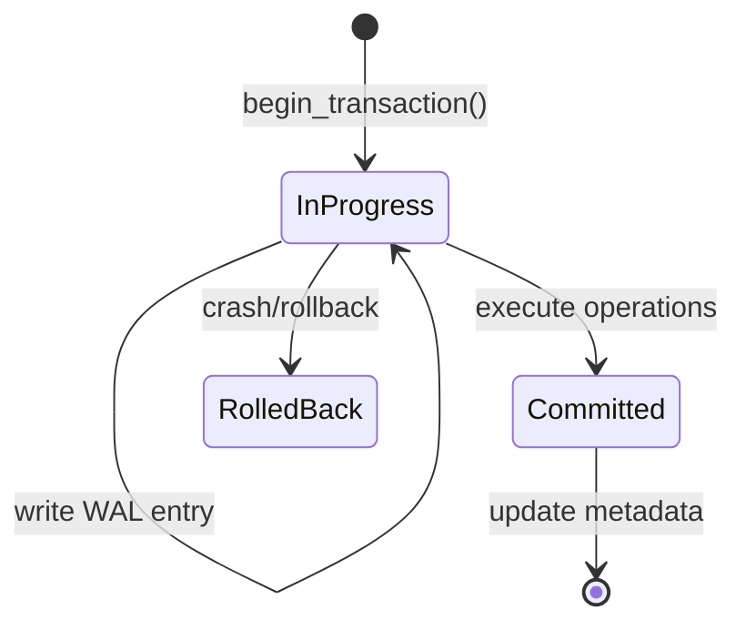

# ZTHFS - Zero-Trust Healthcare Filesystem

[](LICENSE)
[](https://www.rust-lang.org)
[](coverage/tarpaulin-report.html)

## 概述

ZTHFS 实现面向医疗数据保护的透明加密文件系统。系统提供构建 HIPAA/GDPR 合规存储系统所需的密码学原语和安全机制，以完整的 FUSE 文件系统形式交付，支持透明的加密和解密操作。

系统架构采用分层设计，包含八个核心模块。加密模块和完整性模块构成密码学基础，实现 AES-256-GCM 加密和基于 BLAKE3 的完整性验证。安全模块通过 POSIX 权限检查配合用户和组白名单提供访问控制。事务管理通过预写日志确保原子操作，密钥管理模块负责密钥的安全存储和轮转。FUSE 文件系统层通过标准文件系统操作暴露这些能力。

## 代码组织

文件系统实现已重构为聚焦模块，每个模块包含相关操作及内联测试。这种组织方式通过降低导航代码库时的认知负荷来提升可维护性。

模块化结构分离关注点：

- 路径操作处理虚拟到物理路径转换
- Inode 操作管理唯一标识符分配和映射
- 属性操作检索文件元数据
- 文件读写操作处理数据传输，支持分块
- 分块操作优化大文件存储
- 元数据操作持久化文件和目录属性
- 目录操作管理文件夹创建和删除
- 文件创建、复制和属性修改操作提供完整文件生命周期管理

测试覆盖率达到 67.35%，涵盖 1869 行代码，确保关键路径得到验证。

## 密码学安全

加密采用 AES-256-GCM，每文件使用唯一 nonce。nonce 通过 BLAKE3(path || nonce_seed) 派生，该构造确保给定路径的 nonce 生成具有确定性，同时防止不同文件间的 nonce 重用。确定性 nonce 使得文件恢复无需额外 nonce 元数据，而 nonce_seed 的引入防止了可预测性。这种方法在存储效率和密码学安全之间取得平衡，因为 GCM 模式下的 nonce 重用会破坏认证保证。

完整性验证支持两种具有不同安全属性的算法。BLAKE3 通过密钥哈希提供密码学消息认证，适用于需要强完整性保证的数据。CRC32c 为计算效率优先于密码学强度的非关键数据提供轻量级替代方案。校验和存储为扩展属性，支持无需预先解密的验证。

时序攻击防护利用 `subtle` crate 的常量时间比较。认证失败触发指数退避延迟，从 100ms 开始，每次失败翻倍，上限 5 秒。失败尝试计数跨请求持久化，锁定时长计算为 2^(attempt_count - 1) 秒，上限 1 小时。该构造遵循在线攻击缓解的最佳实践，成功暴力破解的成本随尝试次数指数增长。

## 访问控制

安全验证器实现 POSIX 权限检查，并增加用户和组白名单。文件访问要求 `allowed_users` 或 `allowed_groups` 成员资格，确保即使拥有适当 POSIX 权限的用户，除非显式授权，否则无法访问文件。权限检查器从文件元数据提取所有者、组和权限位，然后应用标准 POSIX rwx 逻辑确定访问权限。

零信任模式通过 `with_zero_trust_root()` 启用，移除传统 Unix root 绕过机制。该配置下 uid 0 必须通过与其他用户相同的权限检查，且必须出现在允许用户列表中。root 访问尝试生成 High 级别的审计日志条目，确保特权操作可见。该设计符合零信任原则，即不基于单一身份授予隐式信任。

## 事务管理

预写日志 (WAL) 确保原子操作和崩溃恢复。每个事务在执行前记录到独立的 WAL 文件，创建能够抵御系统故障的持久化日志。事务生命周期经历三种状态：



启动时 WAL 扫描未完成事务并自动回滚，确保一致性。

写时复制 (COW) 原语实现原子文件更新。`atomic_write` 函数将数据写入临时文件，同步到磁盘，然后重命名覆盖目标。POSIX 保证原子重命名操作，防止部分写入变为可见。

## 密钥管理

密钥管理系统提供可插拔存储接口。`InMemoryKeyStorage` 服务于无需持久化的测试场景。`FileKeyStorage` 使用主密钥加密密钥存储，主密钥派生自系统特定熵（主机名、machine-id、用户名）。该派生确保从一个系统提取的密钥无法在另一系统解密，增加物理安全层。

每个密钥附带元数据存储，包括版本号、创建时间戳和过期时间。密钥轮换生成新版本并递增版本计数器。旧版本保持可用直到手动删除，支持渐进式密钥迁移。

## 文件系统操作

FUSE 实现提供十四种操作，覆盖标准文件系统功能。路径解析通过存储于 sled 数据库的双向映射将文件系统路径映射到内部 inode。文件操作支持大文件分块存储，可配置块大小默认为 4MB。

目录操作使用标记文件 (`.zthfs_dir`) 持久化目录元数据，支持跨文件系统重新挂载的属性保留。空目录检查防止删除非空目录。原子重命名操作使用数据库批处理同时移动元数据和分块文件，确保重命名期间的故障不会导致部分移动的文件。

文件属性修改通过 `setattr` 接口支持 chmod、chown、utime 和 truncate 操作。时间转换处理绝对时间戳和 utime 操作的特殊 `TimeOrNow::Now` 值。属性修改前进行权限检查。

完整操作集包括 lookup、getattr、read、write、readdir、create、unlink、mkdir、rmdir、rename、setattr、open、release 和 fsync。所有操作包含权限检查和审计日志。

## 使用方式

### 库 API

核心模块暴露 Rust API 供应用集成。

```rust
use zthfs::{
    core::encryption::EncryptionHandler,
    core::integrity::IntegrityHandler,
    config::EncryptionConfig,
};

let config = EncryptionConfig::random()?;
let handler = EncryptionHandler::new(&config);
let encrypted = handler.encrypt(data, "/path/to/file")?;

let checksum = IntegrityHandler::compute_checksum(
    &encrypted, "blake3", &config.key,
)?;
```

### CLI 命令

二进制文件提供子命令用于文件系统管理。`init` 生成带密码学安全随机密钥的配置文件。`validate` 检查配置文件语法和安全设置。`mount` 使用指定配置挂载 FUSE 文件系统，`unmount` 清理卸载已挂载的文件系统。`health` 显示组件状态用于监控。`demo` 运行加密操作演示用于验证。`info` 显示版本和构建信息。

## 测试

测试套件包含 369 个单元测试，覆盖加密操作、安全验证、密钥管理、事务处理和文件系统操作。测试覆盖率达到 67.35%。

执行 `cargo test --lib` 运行测试套件。FUSE 集成测试需要 root 权限，已标记为忽略。

```bash
# 运行单元测试
cargo test --lib

# 生成覆盖率报告
cargo tarpaulin --workspace --exclude-files '*/tests/*' --out Html

# 代码质量检查
cargo clippy --all-targets
```

## 实现状态

已完成模块包括加密、完整性、日志、配置、安全验证、事务、密钥管理和 FUSE 文件系统实现。全部十四个 FUSE 操作已实现：lookup、getattr、read、write、readdir、create、unlink、mkdir、rmdir、rename、setattr、open、release 和 fsync。

未实现功能包括 HSM/KMS 后端、性能监控指标和综合集成测试。这些代表未来开发领域，而非核心功能缺陷。

## 开发路线图

短期优先级聚焦提升测试覆盖率和生产部署工具。中期目标覆盖 HSM/KMS 后端实现，服务于需要硬件安全模块的环境。长期目标针对分布式存储后端和多租户隔离机制。

## 许可证

```
Copyright (c) 2025 Somhairle H. Marisol

All rights reserved.

Redistribution and use in source and binary forms, with or without modification,
are permitted provided that the following conditions are met:

    * Redistributions of source code must retain the above copyright notice,
      this list of conditions and the following disclaimer.
    * Redistributions in binary form must reproduce the above copyright notice,
      this list of conditions and the following disclaimer in the documentation
      and/or other materials provided with the distribution.
    * Neither the name of ZTHFS nor the names of its contributors
      may be used to endorse or promote products derived from this software
      without specific prior written permission.

THIS SOFTWARE IS PROVIDED BY THE COPYRIGHT HOLDERS AND CONTRIBUTORS
"AS IS" AND ANY EXPRESS OR IMPLIED WARRANTIES, INCLUDING, BUT NOT
LIMITED TO, THE IMPLIED WARRANTIES OF MERCHANTABILITY AND FITNESS FOR
A PARTICULAR PURPOSE ARE DISCLAIMED. IN NO EVENT SHALL THE COPYRIGHT OWNER OR
CONTRIBUTORS BE LIABLE FOR ANY DIRECT, INDIRECT, INCIDENTAL, SPECIAL,
EXEMPLARY, OR CONSEQUENTIAL DAMAGES (INCLUDING, BUT NOT LIMITED TO,
PROCUREMENT OF SUBSTITUTE GOODS OR SERVICES; LOSS OF USE, DATA, OR
PROFITS; OR BUSINESS INTERRUPTION) HOWEVER CAUSED AND ON ANY THEORY OF
LIABILITY, WHETHER IN CONTRACT, STRICT LIABILITY, OR TORT (INCLUDING
NEGLIGENCE OR OTHERWISE) ARISING IN ANY WAY OUT OF THE USE OF THIS
SOFTWARE, EVEN IF ADVISED OF THE POSSIBILITY OF SUCH DAMAGE.
```
