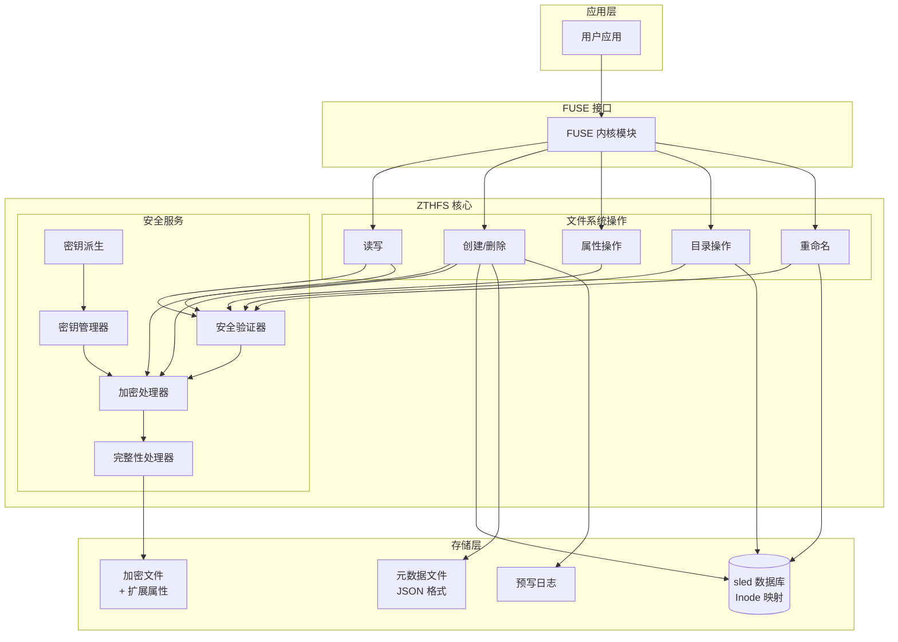
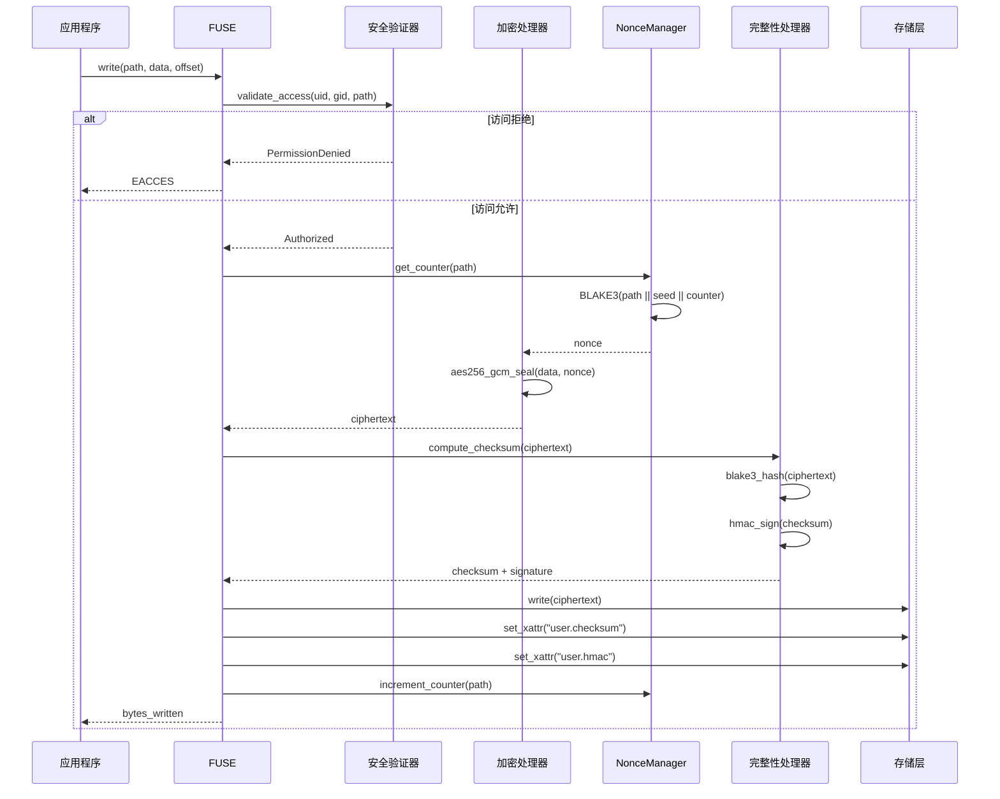
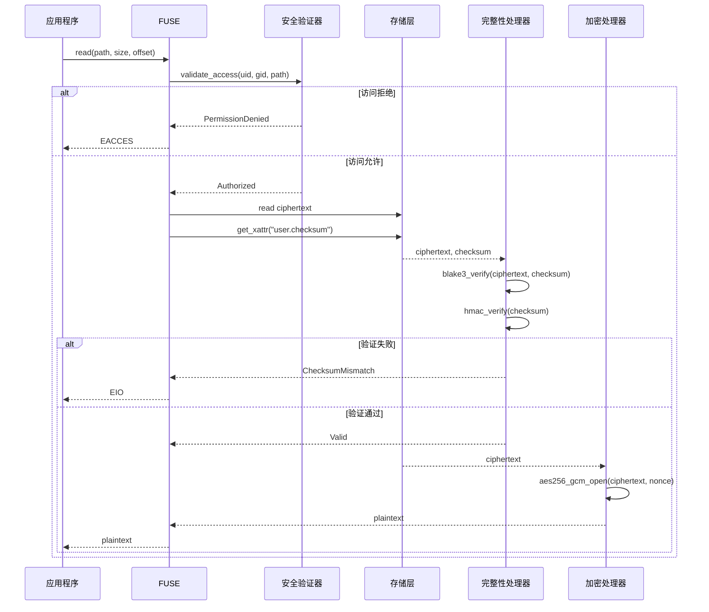
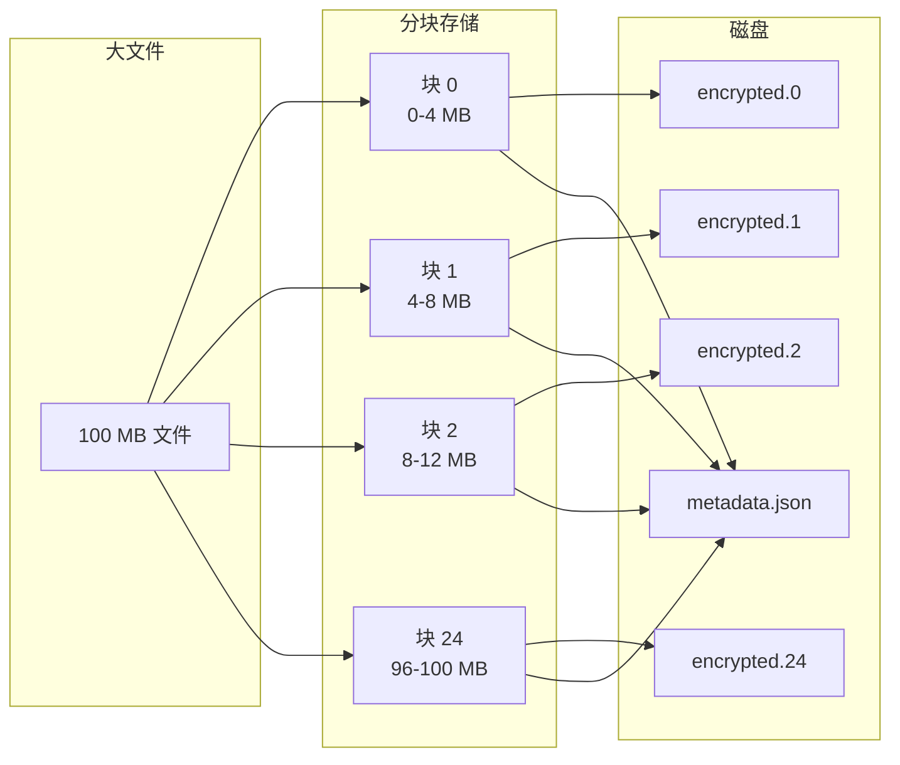
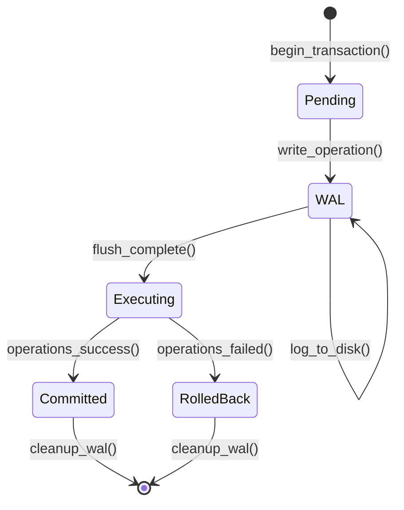

# ZTHFS - 零信任医疗文件系统

[](LICENSE)
[](https://www.rust-lang.org)
[](coverage/tarpaulin-report.html)

## 摘要

ZTHFS 是一个基于 FUSE 的加密文件系统，为敏感数据存储提供透明加密、完整性验证和访问控制。系统实现了基于计数器的 AES-256-GCM 加密、带可选 HMAC 签名的 BLAKE3 完整性验证，以及零信任安全模型——所有用户（包括 root）都需要显式授权。

## 系统架构

系统采用分层架构，职责清晰分离：



## 数据流

### 写入操作



### 读取操作



## 密码学设计

### 加密

ZTHFS 采用 AES-256-GCM 进行认证加密。关键安全属性——nonce 唯一性——通过基于计数器的方案强制执行，每个文件维护一个持久化的计数器，存储为扩展属性。

```rust
use zthfs::{
    core::encryption::{EncryptionHandler, NonceManager},
    config::EncryptionConfig,
};

// 生产环境配置
let config = EncryptionConfig::random()?;
let nonce_manager = NonceManager::new(data_dir.into());
let handler = EncryptionHandler::with_nonce_manager(&config, Arc::new(nonce_manager));

// 每文件唯一 nonce 派生自：
// nonce = BLAKE3(path || nonce_seed || counter)
let encrypted = handler.encrypt(plaintext, "/path/to/file")?;
```

**Nonce 唯一性要求**：GCM 模式 nonce 重用使得通过 XOR 分析使用相同密钥和 nonce 加密的密文来恢复明文成为可能。基于计数器的方法保证了对给定文件路径的所有加密操作的 nonce 唯一性。

### 完整性验证

系统提供两级完整性保护：

1. **BLAKE3 校验和**：作为扩展属性存储的加密数据哈希
2. **HMAC-SHA256 签名**：可选签名，防止具有磁盘写入权限的攻击者篡改校验和

```rust
use zthfs::{
    core::integrity::IntegrityHandler,
    config::IntegrityConfig,
};

// 启用 HMAC 签名以检测篡改
let config = IntegrityConfig::with_hmac_signing(key, hmac_key);
let checksum = IntegrityHandler::compute_checksum(&ciphertext, "blake3", &config.key)?;
let signature = IntegrityHandler::compute_hmac_signature(&checksum, &config.hmac_key)?;
```

### 密钥派生

基于密码的密钥存储使用 Argon2id，这是一种抗 GPU 和 ASIC 攻击的内存硬密钥派生函数。默认参数遵循 OWASP 对交互式登录的推荐：

| 参数 | 值 | 说明 |
|-----|-----|------|
| 内存开销 | 64 MiB | 每次迭代所需内存 |
| 时间开销 | 3 | 迭代次数 |
| 并行度 | 4 | 并行度 |
| 盐长度 | 16 字节 | 密码学安全随机盐 |

```rust
use zthfs::key_derivation::{KeyDerivation, KeyDerivationConfig};

let config = KeyDerivationConfig::high_security();
let master_key = KeyDerivation::derive_key("passphrase", &config)?;
```

## 访问控制

零信任安全模型要求所有用户——包括 root——满足三个独立条件：

1. **白名单成员资格**：用户或组必须出现在显式允许列表中
2. **POSIX 权限**：标准 rwx 位必须授予请求的操作
3. **审计日志**：所有访问尝试都以适当的严重级别记录

```rust
use zthfs::fs_impl::security::SecurityValidator;

// 零信任模式（默认）：root 没有特殊权限
let validator = SecurityValidator::new(config);

// 传统模式：root 绕过权限检查（不推荐）
let validator = SecurityValidator::with_legacy_root(config);
```

## 存储组织

```
/data/
├── zthfs.db                    # sled 数据库：inode ↔ 路径映射
├── inodes/                      # 加密文件存储
│   └── {inode_hash}/
│       ├── data.0              # 分块 0（默认 4 MB）
│       ├── data.1              # 分块 1
│       ├── ...
│       └── metadata.json       # 分块元数据
├── keys/
│   └── master.key.enc          # 加密的主密钥
├── wal/
│   └── {transaction_id}.wal    # 预写日志条目
└── zthfs.log                    # 审计日志
```

## 分块文件存储

超过配置块大小（默认：4 MB）的文件被分割成多个块。该设计实现：

- **高效的部分写入**：仅重新加密修改的块
- **并行 I/O**：块可以并发读/写
- **内存效率**：操作无需将整个文件加载到内存



## 事务管理

通过预写日志（WAL）保证原子操作：



启动时，WAL 扫描未完成的事务并自动回滚，确保崩溃后的文件系统一致性。

## 配置

文件系统接受 TOML 配置文件：

```toml
[data_dir]
path = "/var/lib/zthfs"

[encryption]
algorithm = "aes256-gcm"
key_size = 32
nonce_seed = "base64-encoded-csprng-seed"

[integrity]
algorithm = "blake3"
enable_hmac = true

[security]
zero_trust_root = true
allowed_users = ["alice", "bob"]
allowed_groups = ["medical-team"]
max_failed_attempts = 3
lockout_duration = 3600

[key_derivation]
algorithm = "argon2id"
memory_cost = 65536    # 64 MiB
time_cost = 3
parallelism = 4

[performance]
chunk_size = 4194304   # 4 MB
cache_size = 256
```

## 实现状态

| 模块 | 状态 | 说明 |
|-----|------|------|
| 加密 | 完成 | AES-256-GCM + NonceManager |
| 完整性 | 完成 | BLAKE3 + HMAC-SHA256 |
| 安全 | 完成 | 零信任访问控制 |
| 密钥管理 | 完成 | 基于文件的存储，支持轮转 |
| 密钥派生 | 完成 | Argon2id KDF |
| FUSE 操作 | 完成 | 全部 14 个操作已实现 |
| HSM/KMS 后端 | 计划中 | 硬件安全模块集成 |
| 分布式存储 | 计划中 | 多节点复制 |

## 测试

```bash
# 单元测试
cargo test --lib

# 属性测试（每个属性 256 个用例）
cargo test --lib property_tests

# 覆盖率分析
cargo tarpaulin --workspace --exclude-files '*/tests/*' --out Html

# 代码检查
cargo clippy --all-targets
```

当前测试覆盖率：**64.89%** (1571/2421 行)

## 安全考虑

### 威胁模型

系统缓解以下威胁：

| 威胁 | 缓解措施 |
|-----|----------|
| 未授权数据访问 | AES-256-GCM 加密 + 访问控制 |
| 数据篡改 | BLAKE3 校验和 + HMAC 签名 |
| Nonce 重用攻击 | 基于计数器的 nonce 生成 |
| 密码破解 | Argon2id + OWASP 参数 |
| 权限提升 | 零信任 root 模型 |
| 时序攻击 | 常量时间比较 |

### 已知限制

1. **元数据泄漏**：文件大小、访问模式和目录结构仍然可见
2. **单点故障**：主密钥丢失将导致数据永久无法访问
3. **性能开销**：加密/完整性操作为所有 I/O 增加延迟

## 参考文献

- NIST Special Publication 800-38D: Recommendation for Block Cipher Modes of Operation
- OWASP Argon2id Guidelines: https://cheatsheetseries.owasp.org/cheatsheets/Password_Storage_Cheat_Sheet.html
- FUSE Documentation: https://libfuse.github.io/

## 许可证

BSD 3-Clause - 详见 [LICENSE](LICENSE)

Copyright (c) 2025 Somhairle H. Marisol
